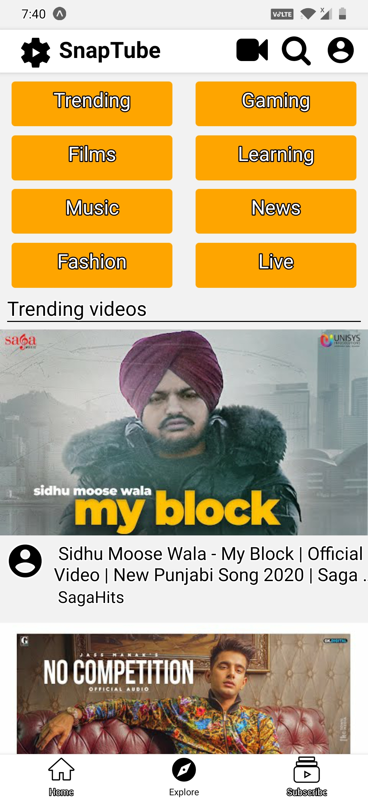
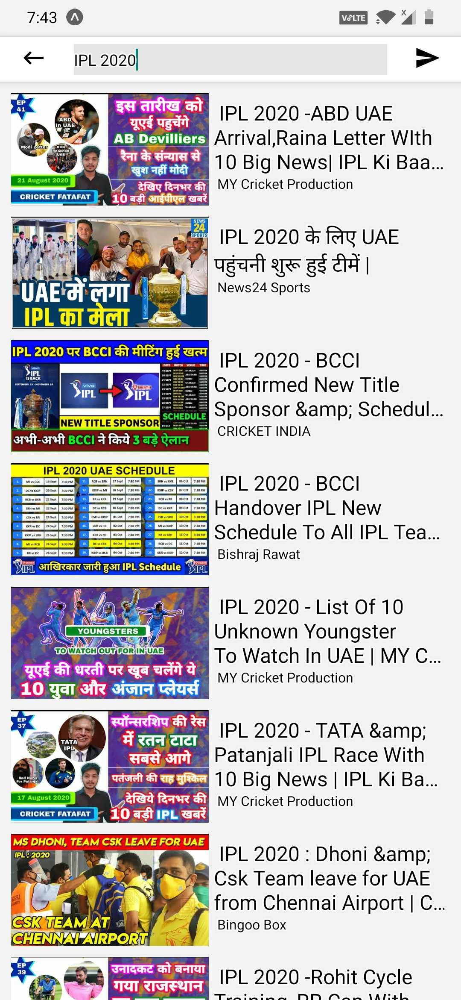
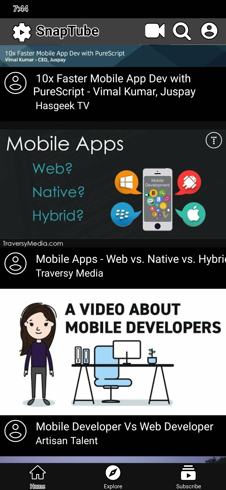

# SnapTube
<B> Home Screen <B>

<B> Explore Screen <B>

<B> Search Screen <B>

<B> Dark Mode <B>

<B> <u> Installation <u> </B>
   
  <ul>
     <li> Fork the Repository </li>
    <li>  git clone <B> Filename </B>.git </li>
    <li> cd <B> Filename </B> </li>
  </ul>
      <B> <u> Running Local: <u> </B>
              yarn start/ Expo start / npm start  
              Scan the QR from Expo Application.
  

